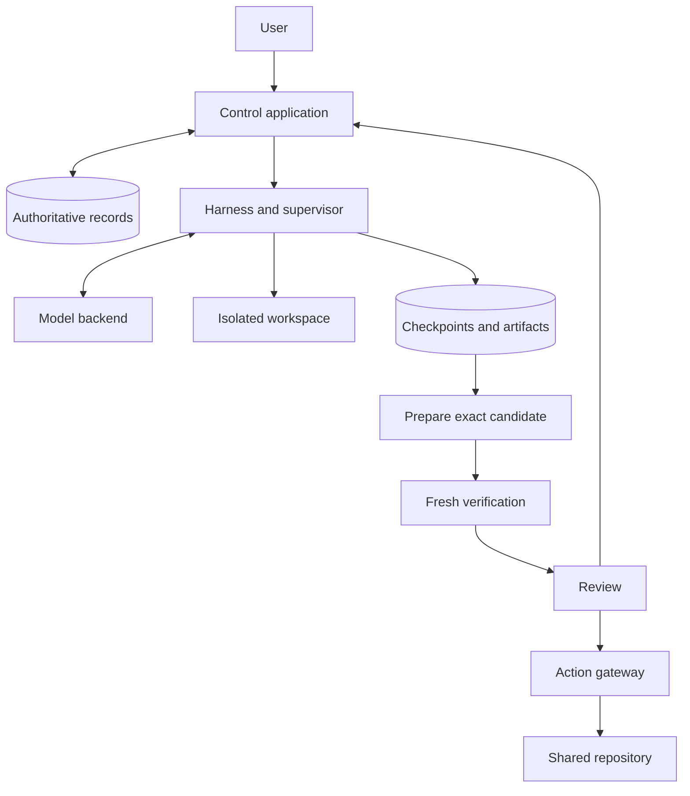

# Durable Orbs and a Minimal Agent Harness

**Design specification · September 25, 2026**

This document is the invariant and protocol contract for a coding-agent platform. It consolidates the orb and harness designs into one specification. It fixes records, state transitions, and failure outcomes; it does not select vendors. A reference-stack companion must name the database, object store, sandbox backend, model backend, and repository connector, with the capability checks in this document applied to each, before Increment 1 begins. The design has been reviewed by model-driven reviewers only; implementation, fault injection, security enforcement, and performance measurements remain to be demonstrated.

Terms used with one meaning throughout:

| Term | Meaning |
|---|---|
| Proposal | A structured model response (`candidate_ready`, `input_needed`, `blocked`) that ends a turn without tool calls |
| Handoff | The durable record created when a proposal or controller condition is consumed; kinds are `candidate`, `question`, `blocker` |
| Source candidate | Immutable identity of the proposed repository contents captured from a continuation |
| Integration candidate | Immutable identity of the source candidate applied to a recorded destination revision |
| Acceptance | A reviewer or policy decision about one exact candidate under one task revision |
| Authorization | Permission to perform one specific act: an authoring lease, a call, a publication dispatch |
| Instruction | A durable user message; kinds are `answer`, `note`, `redirect` |

**A task owns its work. A machine executes it.**

An orb is a durable task with an isolated workspace and an agent that can act inside it. The task retains its instructions, saved files, observations, proposed results, and decisions when its worker stops. A replacement worker resumes from an explicitly saved point.

The consumer must be able to leave, return, understand what happened, and decide what happens next. The maintainer must be able to identify the owner of every state transition and explain recovery without relying on a particular machine remaining alive.

Consider an agent that edits a file and reports that the edit succeeded. If its worker dies, restoring that report alongside the old file would give the replacement agent a false account of its work. The central rule is therefore stronger than saving files or saving a conversation: **every recoverable continuation pairs the conversation with the files it describes.**

**The initial release has a bounded scope.**

Support one repository per task, one model backend, one sandbox backend, one command tool, serial commands within a task, multiple independent tasks, and one repository-publication integration. Review-only tasks may finish without publication. A task records which finish condition applies when it is created.

The harness submits proposed results. The control application handles verification, review, and publication. The model has no direct external-write tool in the initial release.

Persistent preview services, recovery of service memory or mutable database contents, automatic child agents, arbitrary external integrations, model routing, plugin systems, and atomic changes across repositories are outside this release. Tests may start temporary services within a supervised command; those services stop with that command. Saved logs, screenshots, and artifacts remain available for review.

**The design has seven invariants.**

| ID | Required property |
|---|---|
| I1 | At most one attempt per task holds an unexpired authoring lease for the task’s current epoch. Every continuation commit, handoff, and dispatch authorization is a conditional transaction on that `(task, revision, epoch)`; any other epoch is rejected. Old attempts cannot regain authority by reconnecting. |
| I2 | Within the configured storage durability contract, an acknowledged continuation restores byte-for-byte without the original worker’s disk: the same checkpoint manifest hash, conversation cursor, accepted-turn and call states, and environment identity. Its conversation cursor and file checkpoint describe the same completed work. |
| I3 | No command process starts unless a complete accepted-turn record and a committed call-intent record for that call precede the supervisor’s start event. |
| I4 | Required verification evidence, review acceptance, and publication authorization each name an exact candidate hash, task revision, verification-profile version, and environment identity, and are valid only while all four match in one conditional transaction. |
| I5 | Every external mutation attempt ends in exactly one durable state: `not_dispatched`, `succeeded` with a destination receipt, `failed` with an authoritative destination response, or `outcome_unknown`. No retry is issued from `outcome_unknown` until reconciliation moves it to `succeeded` or `failed`. |
| I6 | One task cannot read or write another task’s workspace, scratch, cache, or object namespace. Publication is a compare-and-swap on the expected destination revision, not a prior read followed by a write. |
| I7 | Every billable execution holds a reservation from admission until provider-confirmed termination and settlement. Available capacity always subtracts every unsettled reservation, including those of replaced, deleted, and uncancelled executions. |

These are implementation requirements. The validation plan below defines how to exercise them.

**The control application owns authority; the harness owns the loop.**

| Component | Responsibility |
|---|---|
| Control application | Own task records, task revisions, workflow phase, leases, budgets, continuations, wakeups, and acceptance decisions |
| Harness | Prepare model input, accept complete responses through the controller, run approved calls in order, and propose results or questions |
| Trusted supervisor | Keep model credentials, enforce process and resource limits, run sandbox commands, capture observations, and prepare consistent snapshots |
| Sandbox | Hold editable repository files and execute repository code within enforced boundaries |
| Verification controller | Run the approved checks in fresh execution environments and attest their observations |
| Integration module | Construct the candidate that would be published against a recorded destination revision |
| Action gateway | Authorize, dispatch, record, and reconcile supported external mutations |

Begin with one control application, a transactional database, immutable object storage, and a trusted worker process controlling an isolated sandbox. Scheduling, integration, verification coordination, and the gateway can be modules in the control application. They do not each require a separate deployed service. The harness and supervisor can share a trusted process.

Keep trusted processes outside the writable sandbox. Repository code must not be able to modify them, read their credentials, forge their recording channels, or widen its authority. Enforce filesystem, process, and network boundaries outside the sandbox’s administrative control.



**Persist one authoritative recovery pointer.**

| Record | Required contents |
|---|---|
| Task | Owner, repository, immutable task revisions, current revision, finish condition, requested state, workflow phase, current epoch, current continuation reference, active handoff reference, authority policy, and budget account |
| Attempt | Task revision, execution epoch, lease expiry, observed process state, assigned workspace identity |
| Continuation | File-checkpoint reference, environment version, committed conversation cursor, pending accepted turn, next call index, and version |
| Checkpoint | Content-addressed manifest hash; entries of canonical relative path, mode class, and blob hash or symlink target; declared exclusions; provenance and snapshot sequence |
| Model request | Controller request ID, request slot, task revision, epoch, provider idempotency key, dispatch state, provider request identity when returned, reservation reference |
| Accepted turn | Controller turn ID, model-request slot, complete response, ordered calls, required backend continuation metadata, and consumption state |
| Call | Stable controller call ID, turn and ordinal, immutable arguments, status, execution tries, and observation reference |
| Observation | Observation ID, kind, task revision, epoch, producing call or controller event, exit status where applicable, bounded excerpt, artifact references, and terminality |
| Handoff | Handoff ID keyed by consuming turn, kind, task revision, source-candidate reference or question text or blocker reason, and resolution state |
| Instruction | Instruction ID, author, kind, text, task revision it was recorded under, and the handoff it resolves if any |
| Wake request | Wake ID, task, task revision, cause, creation transaction, and claim state |
| Candidate | Immutable source or build-artifact identity, kind (`source` or `integration`), task revision, base revision, environment identity, verification-profile version, dependency-closure hash, and provenance |
| Verification evidence | Candidate identity, profile version, environment, dependency-closure hash actually used, observations, limits, and verification-controller identity |
| Acceptance | Exact candidate identity, task revision, applicable evidence, accepting actor or policy, and decision |
| External operation | Stable operation ID, immutable arguments and hash, candidate and task references, destination, expected destination version, authority basis, dispatch attempts, and receipt |
| Spending entry | Logical work reference, distinct billable-execution identity, reservation, observed usage, settlement, and any unresolved amount |

Enumerated statuses. Each transition below is a conditional write; no other transitions exist.

| Field | Values and legal transitions |
|---|---|
| Requested state | `active ⇄ paused`; `active → cancelled`; `paused → cancelled`. `cancelled` is terminal. |
| Observed process state | `starting → running → draining → stopped`; any state `→ lost`. Written only by the control application from supervisor heartbeats and backend termination confirmations. |
| Model request dispatch state | `registered → sent → accepted`; `sent → failed`; `sent → outcome_unknown`; `outcome_unknown → accepted` or `→ failed` only through provider lookup. |
| Turn consumption | `pending → consumed`. |
| Call status | `accepted → confirmed → executing → observed`; `accepted → error` (malformed or unsupported, never executed); `accepted → not_executed` with a reason (`superseded`, `denied`); `executing → interrupted`. `observed`, `error`, `not_executed`, and `interrupted` are terminal. |
| Handoff resolution | `open → resolved` by exactly one transition-table row: completion, a callback returning the task to `work`, an instruction of kind `answer` or `redirect`, or explicit user resolution of a blocker. A `candidate` handoff stays open through `verification`, `review`, and `publication`; the Task’s active handoff reference points at it. |
| Wake claim | `pending → claimed → granted` or `→ ineligible`. Claiming is the lease-grant transaction. |
| Operation dispatch attempt | `authorized → sent → succeeded` or `→ failed` or `→ outcome_unknown`; `outcome_unknown → succeeded` or `→ failed` only through a supported destination read. |

A task revision binds the instructions, finish condition, base-environment identity, required verification-profile version, and task-specific authority policy. Changing any of these creates a new revision and invalidates pending decisions bound to the old one. Updating a shared profile template does not silently alter existing tasks; applying that update creates a task revision. Live credential or access revocation takes effect immediately regardless of revision.

The Task record’s current continuation reference is the sole authoritative recovery reference. A replacement attempt reads it from the Task in the lease-grant transaction; Attempts do not carry their own copy. A newer file snapshot or log entry cannot independently replace it. Files and observations may be uploaded before a commit, but remain provisional until the database publishes their references together.

Use conditional database transactions to check the current task revision, current epoch, permitted task state, and expected prior continuation. Object ingestion itself is not fenced: any worker may upload blobs. Only the continuation commit is fenced, so a late commit from an older epoch fails regardless of its snapshot sequence. Store the state transition and its audit event in the same transaction.

Object uploads use narrow credentials or a trusted proxy. Workers cannot overwrite immutable artifacts or declare their own upload authoritative. Garbage collection protects active uploads, pending publications, retained continuations, candidates, and accepted results before reclaiming unreferenced objects.

A checkpoint is a content-addressed manifest. Each entry records a canonical relative path, a mode class (`file`, `executable`, `symlink`, `directory`), and either a blob hash or a symlink target string. Blobs are deduplicated in object storage by hash. The manifest hash is the checkpoint identity. The snapshotter reuses the previous manifest’s hashes for entries whose size and modification time are unchanged, so the cost of a checkpoint is proportional to changed bytes plus one directory walk. The workload measurements below set the accepted bound for that walk; less frequent checkpointing is permitted only if it preserves the paired-commit invariant.

Snapshot and restore reject entries whose canonical path escapes the workspace root, device nodes, sockets, and FIFOs. Symlinks are recorded as targets and never followed during snapshot; hard links are recorded as independent entries. Ownership, setuid, and setgid bits are not recorded. Restore writes only beneath the fresh workspace root, refuses to follow an existing symlink when writing, and verifies every blob hash before the continuation is exposed to the model.

A continuation commit is acknowledged only after object storage confirms durable persistence of the manifest and every referenced blob under the configured durability contract. I2 holds within that contract. A referenced object missing or corrupt on restore is a fault outside the contract; it is reported as a visible recovery failure, never repaired by pairing older files with newer history.

**Keep requested state separate from workflow phase.**

Requested state is `active`, `paused`, or `cancelled`. Workflow phase is `work`, `verification`, `review`, `input`, `blocked`, `publication`, or `complete`. Observed process state records whether a worker is starting, running, draining, stopped, or lost.

The following table is the complete set of workflow-phase transitions. A transition not listed here does not exist. Every row is one conditional transaction on the current task revision and, where a worker is involved, the current epoch. Rows marked *wake* create a Wake request in the same transaction. Rows marked *revision* create a new task revision in the same transaction.

| From | Event | To | Effects |
|---|---|---|---|
| — | Task admitted | `work` | wake |
| `work` | Turn consumed with `candidate_ready` | `verification` | Handoff `candidate` opened; source candidate captured; authoring lease closed; verification run enqueued |
| `work` | Turn consumed with `input_needed` | `input` | Handoff `question` opened; authoring lease closed |
| `work` | Turn consumed with `blocked`, or controller records a context-limit or step-limit blocker | `blocked` | Handoff `blocker` opened with reason; authoring lease closed |
| `verification` | Integration cannot apply the source candidate | `work` | Conflict observation appended; handoff resolved; wake |
| `verification` | Evidence fails the required profile | `work` | Diagnostic observation appended; handoff resolved; wake |
| `verification` | Verification run fails for infrastructure reasons past its retry limit | `blocked` | Handoff `blocker` with reason `verification_unavailable` |
| `verification` | Evidence satisfies the required profile | `review` | Handoff stays open; evidence linked |
| `review` | Acceptance recorded; finish condition is review-only | `complete` | Handoff resolved |
| `review` | Acceptance recorded; finish condition is publication | `publication` | Publication authorization and External operation registered; dispatch enqueued |
| `review` | Reviewer requests changes | `work` | Instruction `redirect` recorded; revision; wake |
| `publication` | Receipt joins current acceptance | `complete` | Handoff resolved |
| `publication` | Destination revision no longer matches | `verification` | New integration candidate constructed; verification run enqueued |
| `publication` | Operation `outcome_unknown` cannot be reconciled, or authority revoked | `blocked` | Handoff `blocker` with reason `publication_unresolved` |
| `input` | Instruction `answer` recorded | `work` | Handoff resolved; answer appended as an observation; wake |
| `blocked` | User resolves the blocker | `work` | Handoff resolved; resolution appended as an observation; wake; revision if the resolution changes instructions or environment |
| any except `complete` | Instruction `redirect` recorded | `work` | Revision; open handoff resolved as superseded; in-flight verification or integration run cancellation requested; wake |
| any | Requested state becomes `cancelled` | unchanged | Authoring and publication authority revoked; no further rows apply except reconciliation of existing operations |

Requested state gates who may drive a row. Worker-driven rows (the three `work` exits) require requested state `active`, because the worker’s controller operations carry that precondition; under pause the drain permit may commit a paired observation but not consume the turn. Rows driven by a verification or integration callback, an instruction, or admission commit while `paused`, but the Wake request they open is `ineligible` for claiming and no publication dispatch is authorized until requested state returns to `active`. Resuming re-evaluates every pending wake. A `note` instruction changes no phase; it is appended as an observation before the next model request.

Grant an authoring lease only by claiming a pending Wake request whose task is `active`, whose phase is `work`, whose revision is current, when no unexpired authoring lease exists, and when sufficient spending has been reserved. Increment the Task’s current epoch and create the Attempt in the same transaction. Renewals check the same authority using the database’s time. An eligibility scan runs on a fixed interval and creates a Wake request for any task that is `active`, in `work`, has no unexpired lease, and has no pending wake, so a lost wake delivery delays authoring by at most one interval.

A lease is temporary permission to advance authoritative state. It does not physically stop a process. Correctness comes from the epoch check on every continuation commit, handoff, and dispatch authorization. Liveness comes from the control application, not the worker: when a lease expires without renewal, the control application marks the Attempt `lost` and instructs the execution backend directly to terminate or isolate that sandbox. It waits for the backend’s confirmation before reusing the workspace. If confirmation cannot be obtained within the run profile’s bound, the replacement receives a different workspace and the old one is quarantined.

Durable wake requests may be delivered more than once. Their identifiers and the lease-grant transaction prevent duplicate authorized attempts. A handoff changes workflow phase, so an idle task does not restart authoring just because it remains active.

**Run one small, explicit agent loop.**

The initial tool is `command`. It accepts a command string and a working directory inside the assigned workspace. The supervisor chooses the sandbox, environment, maximum duration, output limit, and execution identity. The model may request a shorter duration but cannot raise its limit or choose a host execution context.

Validate tool names and argument structure at the model-adapter boundary. Treat every command as potentially changing local state. Run commands serially. Keep process supervision, lease checks, and stop handling responsive while a model request or command is in progress.

Stop all command descendants before acknowledging its result and snapshot. Do not permit unmanaged background processes. This removes the start-a-server-then-probe-it workflow across commands; the initial release accepts that cost and tells the model, in every request, that a service must be started, exercised, and stopped within one command. Task success rate under this rule is one of the workload measurements.

All sandbox egress passes through a supervisor-owned proxy that holds no task credentials. The run profile names an allowlist of destination hosts and path prefixes; the proxy refuses everything else, follows no redirects off the allowlist, and records every request line as an observation artifact. “Read access” means an allowlisted destination whose contract the operator has classified as non-mutating; the HTTP verb is not the classification. External mutation credentials remain with the gateway. Because an allowlisted destination can still receive encoded data in a request, workspace secret exfiltration is bounded, not prevented: admission scans the repository for known credential patterns and warns, and the proxy log is part of the review record. The model adapter does not enable hosted tools that execute outside these controls.

Each model request is registered before it is sent. The Model request record carries a controller request ID, the request slot, the current revision and epoch, a provider idempotency key derived from the request ID, and the reservation for that generation. A worker that dies after sending leaves the record in `sent`. Recovery moves it to `accepted` only if the provider supports lookup by idempotency key and returns the complete response; otherwise it becomes `outcome_unknown`, its reservation is retained until settlement, and the replacement opens a new slot. Follow-up requests to a stateful backend always continue from the last accepted turn’s continuation metadata, so an abandoned server-side branch is never referenced again.

Model responses can contain tool calls or a structured proposal: `candidate_ready`, `input_needed`, or `blocked`. A proposal includes a short explanation. It does not accept the task or establish that its checks passed.

```text
state = restore_authoritative_continuation()

while controller.permits_this_authoring_attempt():
    turn = load_pending_turn(state)
    if turn is absent:
        input = compose_model_input(state, controller.current_task())
        request = controller.register_model_request(state)
        response = model.generate_complete_response(input, request.idempotency_key)
        state, turn = controller.accept_response_once(request, response, state)

    for call in turn.remaining_calls:
        if call is invalid or unsupported:
            state = controller.commit_call_error(call, state)
            continue

        permit = controller.authorize_current_call(call)
        if permit is denied:
            return supervisor.stop_and_report()

        controller.confirm_call_intent(call, state)
        observation = supervisor.run_bounded_command(call)
        files = supervisor.snapshot_after_stopping_writers()
        state = controller.commit_observation_and_files(
            call, observation, files, expected_state=state)

    state, handoff = controller.consume_turn_once(turn, state)
    if handoff exists:
        return supervisor.stop_and_handoff(handoff)

return supervisor.stop_and_report()
```

This is structural pseudocode. Each controller operation is one conditional transaction whose precondition includes the current task revision, the caller’s epoch, and requested state `active`. The table below is their contract. Failed persistence, lost acknowledgments, and control changes stop the ordinary path and use the recovery rules below. The loop’s first check alone is insufficient authorization.

| Operation | Reads | Writes | Idempotency key |
|---|---|---|---|
| `restore_authoritative_continuation` | Task current continuation, Continuation, Checkpoint, pending Accepted turn and its Calls | Observation of kind `restored` | Attempt epoch (one restore observation per attempt) |
| `permits_this_authoring_attempt` | Task requested state, phase, revision, epoch; Attempt lease expiry; run-profile step count | Lease renewal | — |
| `load_pending_turn` | Continuation pending accepted turn; Accepted turn; Calls | — | — |
| `register_model_request` | Continuation, Spending entry | Model request `registered`; reservation | Controller request ID (one open request per slot) |
| `accept_response_once` | Model request, Continuation | Model request `accepted`; Accepted turn; Calls `accepted`; Continuation pending turn | Request slot (second acceptance fails) |
| `commit_call_error` | Call | Call `error`; Observation; Continuation next call index | Call ID |
| `authorize_current_call` | Task, Attempt, Call, run profile | Call `not_executed: denied` on refusal | Call ID |
| `confirm_call_intent` | Call `accepted` | Call `confirmed`; execution try | Call ID and try number |
| `commit_observation_and_files` | Call `confirmed` or `executing`; expected prior Continuation | Observation; Checkpoint reference; Call `observed`; new Continuation; Task current continuation | Expected prior continuation version |
| `consume_turn_once` | Accepted turn `pending`; all Calls terminal | Accepted turn `consumed`; Continuation pending turn cleared; next request slot or Handoff; Task phase per the transition table | Turn ID (returns the existing Handoff on retry) |

**Consume each model decision once.**

Display streamed text as provisional. Execute nothing until a complete response has been durably accepted. The controller accepts one response per model-request slot. Late duplicate responses remain historical observations and cannot create another action batch.

Save a returned batch before executing its first call. Assign each call a stable controller identity based on the accepted turn and ordinal. Preserve backend call identifiers separately for constructing valid follow-up requests. Replacing the worker does not change a logical call’s identity.

After all calls have terminal observations, one transaction consumes the turn, clears its pending pointer, and either creates the next request slot or records its handoff. The transaction checks the current revision, epoch, and permitted state even when the response contains no tool calls. Handoffs are keyed by turn ID, so retries return the existing handoff.

A complete response with neither calls nor a valid proposal records an invalid-response observation, consumes its slot, and receives a bounded correction attempt. Malformed calls receive explicit error observations without execution. Neither case may create an endless loop.

**Save observations and files together after every command.**

Confirm the call-intent record before execution. After the command terminates and its writers stop, upload the observation and consistent file checkpoint. Atomically advance their references, the conversation cursor, and next call index under the expected prior continuation.

A nonzero exit is an observation, not a storage failure. Commit its actual output and resulting files so the model can inspect partial changes. A command that has not reached a confirmed continuation commit remains uncommitted, regardless of provisional logs or uploaded objects.

If a persistence response is lost, query its stable identity before proceeding. If the controller cannot establish the outcome, stop at that boundary. Never infer from a timeout that the commit failed.

The initial recovery contract covers repository files, durable task history, and observations. Temporary process state is discarded. Every command result the model sees as completed was committed in a paired continuation; a command that was interrupted, cancelled, crashed, or ran out its drain window ends without advancing the continuation and is represented by an `interrupted` call status and observation. Less frequent checkpointing is a later optimization that must preserve the same pairing.

Pin the base environment by immutable identity. System tools and configuration in that base are read-only to task commands. The workspace is the only durable writable root in the initial release; its checkpoint includes dependency files and configuration even when Git ignores them. Install project dependencies there. Other permitted writable directories are declared disposable scratch space. Changing system tools requires selecting a new prepared environment in a new task revision. Record the environment change for the next attempt and rebuild affected dependencies before relying on them.

On replacement, restore the pinned base and the workspace checkpoint. Before the next model request, append a controller observation naming the restored continuation and stating that scratch files and processes were discarded. The recovery snapshot and the submitted source candidate have separate manifests: recoverable dependency files need not be proposed source changes.

On failure, stop or isolate the old execution boundary and restore the latest acknowledged continuation. The initial release never replays an interrupted command automatically. No component can establish from a shell command string whether its effects were confined to the workspace, and an allowlisted read destination is still a remote party. The interrupted call receives status `interrupted` and an observation stating what is known: the command, how long it ran, any captured output, and that its filesystem effects were discarded with the workspace restored to the prior continuation. The model decides whether to reissue it as a new call. Automatic replay for a declared effect class is a later addition that requires the proxy to attest no external request was made during the interrupted try.

If a committed checkpoint is missing or corrupt, recovery fails visibly. Choosing an older continuation requires an explicit recovery decision that reports lost progress and preserves external-operation records. Never place a newer conversation over older files.

Suspended machines are optional caches. Before assigning one to another epoch, confirm that the old agent and command descendants have stopped. Refresh credentials and validate its environment. Losing the machine cache must not lose an acknowledged continuation.

**Define pause, cancellation, and redirection precisely.**

Pause prevents new model calls, command dispatches, authoring lease grants, terminal handoffs, and publication dispatch authorizations. The current command receives a bounded drain window. Under a restricted drain permit, the supervisor may commit its terminal or interrupted observation together with the files that observation describes. It then fences the attempt. If that paired commit cannot finish before the deadline, preserve the previous continuation and discard uncommitted work. Pause never saves files alone. External dispatches already authorized may still reach their destination; reconcile and display them as described below.

Cancellation immediately revokes new authoring and mutation authority. The supervisor cancels model requests and stops commands. The interface reports stopping until termination or isolation is confirmed, and continuing billable compute remains visible. Recovery guarantees only the last acknowledged continuation. A previously authorized external dispatch may still reach its destination or finish and remains subject to reconciliation.

A user message is recorded as an Instruction of one kind, and the kind determines its effect. An `answer` resolves an open `question` handoff and returns the task to `work` without a revision. A `note` is appended as an observation before the next model request and changes nothing else; it is the default kind while the task is in `work`. A `redirect` creates a new task revision; it is the only kind permitted while the task is in `verification`, `review`, or `publication`, because a message there necessarily changes what is being judged. The interface shows the kind it will record and lets the user change it before sending.

Redirection is one transaction: it creates the new revision, sets phase `work`, resolves any open handoff as superseded, marks the old candidate’s evidence and acceptance as retained but inapplicable, requests cancellation of any in-flight verification or integration run while keeping that run’s reservation until settlement, and opens a Wake request. Undispatched calls receive `not_executed: superseded`. An interrupted local call gets an `interrupted` record after its uncommitted changes are discarded or deliberately paired and saved through an authorized drain permit. Preserve committed results and their matching files. Begin the revised job from a coherent continuation and a new request slot. Do not resume work while requested state is paused or cancelled.

The model adapter accounts for every accepted call when preparing a follow-up request. Outstanding external uncertainty remains visible across all these transitions.

**Build model input from authoritative state.**

Every request includes the current task, finish conditions, limits, workspace description, tool definitions, and relevant committed observations. Repository text and command output are data. They cannot change permissions, task revision, or completion criteria.

Retain full visible history in durable storage. When it no longer fits, summarize older completed turns into a short memo that names its source range. A model-written memo is a fallible navigation aid and cannot establish permissions, verification, or completed actions. Every request also carries a controller-rendered fact block that the memo cannot displace: the current instructions verbatim, the list of files changed since the task’s base revision computed from the current checkpoint manifest, every open handoff and unresolved external operation with its receipt state, and the restored-continuation observation if this attempt restored. The fact block is placed after the memo so that a memo contradicting it is visibly contradicted. Recovery does not depend on access to private model reasoning.

Store large output as bounded task artifacts and provide useful excerpts. Approved read-only copies can be made available to commands for inspection. Apply task access controls to prompts, files, and logs. Keep known credentials out of collection paths; arbitrary output cannot be assumed safe because a text filter ran.

If mandatory instructions and the fact block cannot fit, the controller records a Handoff of kind `blocker` with reason `context_limit` and the task enters the `blocked` phase. Bound model requests, command duration, corrective retries, execution steps, output storage, and spending through an explicit run profile; exhausting the step limit is a blocker with reason `step_limit`.

**A proposed result enters a separate completion path.**

The terminal-turn transaction captures a source candidate from committed state, records the handoff, changes workflow phase, and closes authoring authority. The supervisor stops the worker. Verification and integration use their own constrained controller authority.

For a review-only task, verify the source candidate directly. For a publication task, first construct the exact integration candidate against the current destination revision. If integration cannot resolve the changes, record the conflict and return the task to `work` through the transition table with those diagnostics.

Run required checks on the resulting immutable candidate. Only the verification controller may publish evidence that satisfies those checks. It records the candidate, approved profile, environment, and observations through a channel outside the candidate’s authority. The authoring harness’s logs remain useful supporting material but cannot impersonate verification evidence.

Verification resolves dependencies from an immutable closure, never from a floating resolution. The required profile declares which: either the candidate must contain a lockfile with integrity hashes and the verification environment installs from it against the pinned dependency mirror, or the authoring checkpoint’s dependency directories are attached as a read-only verification input identified by hash. The candidate and the evidence each record the dependency-closure hash they used. When the two differ, the evidence carries a `dependency_drift` flag and the review view shows it; a profile that forbids drift fails the check. Network access during verification is limited to the pinned mirror.

Keep the required test harness and reporting channel outside the candidate’s writable namespace. Tests written by the task can add evidence but cannot silently replace approved checks. Record relevant external inputs and any limits on reproducibility.

Successful verification moves the task to `review`. A failed check records diagnostics and returns it to `work` through the transition table, which opens the Wake request; the wake is claimable only while requested state is active and budget remains. An `answer` instruction follows its own row and likewise opens a wake and a new request slot.

Verification and integration callbacks change phase only through an idempotent conditional transaction matching the current task revision, active handoff and candidate, expected phase, and authorized run identity. Stale or duplicate callbacks may retain their evidence but cannot redirect the current task. A callback received while paused commits its transition-table row; the wake it opens stays ineligible and no publication dispatch is authorized until requested state returns to `active`.

Review acceptance is a conditional decision about exact candidate contents under the current task revision and verification profile. A stale review screen cannot accept a revised task. The initial release carries no approval automatically onto changed integration contents: a new candidate requires applicable checks and review again.

For publication, a separate authorization names the accepted integration candidate, destination, and expected destination revision. A publication receipt records what the destination actually accepted. Completion conditionally joins the current acceptance with the required receipt. Review-only completion needs no publication receipt. An operation in `outcome_unknown` that the finish condition requires prevents completion until reconciliation resolves it; if reconciliation cannot resolve it, the task enters `blocked` with reason `publication_unresolved`.

Completion makes authoring wakes ineligible. It does not erase outstanding accounting or reconciliation obligations.

**Register external operations before dispatch.**

The initial integration module is the sole requester of repository mutations. One controller transaction records immutable operation arguments, authorization basis, candidate, destination, and expected destination version, then links that operation to the task’s publication phase. Dispatch cannot occur before registration is confirmed.

The gateway serializes dispatch authorization with revocation in the control database. New publication dispatch and mutation retries require requested state active and workflow phase publication. The transaction also checks the current task revision, integration ownership, exact publication authorization, applicable acceptance and evidence, and available spending. A changed required profile creates a new task revision and invalidates pending authorization. An already authorized older operation remains visible but cannot automatically complete the revised task.

The committed dispatch-authorization transaction is the ordering point. Revocation blocks subsequent authorizations. An already authorized dispatch may reach the destination afterward and is shown as potentially in flight. Claim each network attempt for one dispatcher using a recorded execution identity and lease. An uncertain dispatcher failure requires reconciliation; it does not permit another dispatcher to reuse that attempt blindly. Each retry creates a new dispatch attempt and requires a fresh authorization check, while retaining the logical operation ID.

Use destination-supported idempotency or conditional writes where available. Reusing an operation ID with different arguments is rejected. If a response is lost after the request may have succeeded, record `outcome_unknown` and reconcile through a supported read operation. Without a reliable deduplication or lookup protocol, stop for resolution.

Every newly authorized mutation request, including a retry, requires current authority. Paused or cancelled tasks permit read-only reconciliation, but no new mutation authorization. A request authorized before the state change may complete. Any compensating action requires separate authorization.

Before publishing, conditionally update the destination only if its expected revision still matches. If another change wins, prepare a new integration candidate, rerun required checks, and obtain new acceptance. This prevents silent overwrites by participating tasks; checks and review still determine behavioral compatibility.

If a future release adds a model-facing external-action tool, its registration transaction must also link the pending operation to the harness continuation before dispatch. Recovery must retain that identity rather than regenerate the action.

**Reserve spending for physical executions, not just logical requests.**

Worker allocations, model generations and retries, verification runs, and paid gateway actions use the task’s budget ledger. Reserve before starting each bounded billable execution. Distinct billable attempts receive distinct reservation identities even when they share a logical request or operation ID.

Keep a reservation while its execution can still incur charges or its cost remains uncertain. Releasing an authoring lease does not release its worker reservation. A replacement requires another reservation. Settlement and release are idempotent transitions keyed to the billable execution.

Exact invoice ceilings require enforceable provider limits and bounded termination delay. The system enforces admissions and exposes unresolved reservations; it must not advertise stronger financial guarantees than its configured providers support.

**Make returning to work the main user experience.**

The task view shows the current goal, observed state, changes, applicable evidence, next decision, and spending. Summaries link to underlying observations and show when they are stale. Saved review data remains accessible without a live worker.

An example view:

> **Dark mode — ready for review**
> Request: add a manual theme choice while preserving the system default.
> Changed: added the selector and retained the existing default behavior.
> Checks: required browser checks passed for this version.
> Next: inspect the saved appearance screenshots and accept or request a change.
> Worker stopped. Reviewing these results does not start compute.

This illustrates the interface; it is not an observed test result. If evidence is incomplete or superseded, show that state and offer the required next action instead of presenting acceptance as ready.

Bound unfinished automatically started work, counting tasks awaiting review. Stop automatic starts when the configured limit is reached. Explicit user starts may exceed this attention limit with the backlog visible, subject to hard execution and spending limits. Track review delay alongside accepted throughput.

**Configure capabilities explicitly before admitting work.**

The execution backend must support enforced isolation, bounded execution, independent termination or isolation confirmation, consistent repository snapshots, and restore into a fresh workspace. The control storage must provide conditional transactions; artifact storage must confirm durable uploads and preserve referenced immutable contents.

The model adapter must support complete-response validation, stable request bookkeeping, tool-result formatting, output limits, and cancellation or an honest record of uncancelled billable work. It preserves backend continuation fields without exposing provider-specific transport details to the main loop.

The repository connector must provide conditional destination updates and a documented way to reconcile uncertain operations. Reject publication configuration that cannot support the stated contract. Review-only work remains available.

A run profile specifies finite lease and drain durations, model and command limits, correction and step limits, output and storage limits, spending policy, and required verification profile. Retention configuration names the treatment of histories, checkpoints, accepted artifacts, audit records, credentials, and backups. Admission rejects missing required capabilities or limits. Vendor selection and numerical tuning do not change the invariants.

Deletion first writes a tombstone on the task: it becomes unavailable for new work, authority is revoked, and late uploads and wakes are refused. Retention workers then remove the promised records and unreferenced artifacts, except that Spending entries with unsettled reservations, the budget account they reference, and External operations not yet in `succeeded` or `failed` are preserved until settlement or reconciliation completes. Already published commits and external service records remain governed by their own owners; task deletion does not claim to retract them.

**Keep the first implementation easy to trace.**

Use a main loop module, a model adapter, a supervisor/runner, a context builder, and a controller client where these responsibilities need separation. Avoid pass-through layers and a generic workflow language. Keep state definitions and transitions together in the control application.

The component table above maps onto modules as follows. The control application is one deployable holding the scheduler, the verification controller, the integration module, and the action gateway as modules; the controller client is the harness’s interface to it. The harness and supervisor are one trusted worker process containing the main loop, model adapter, context builder, supervisor/runner, and egress proxy. The sandbox is a backend-provided isolated workspace the supervisor drives through the backend’s API. Verification runs in a separate fresh sandbox driven by the verification controller. Increment 1 delivers the worker process and the control application’s task, attempt, continuation, model request, turn, call, and observation records; later increments add the remaining modules.

The chosen design combines the continuity of a persistent workspace with explicit recovery. A machine-per-task design offers simpler initial interaction but makes recovery depend more heavily on machine state. Fully stateless workers make bounded jobs easier to replace but require exploratory work to reconstruct its environment repeatedly. The hybrid’s extra bookkeeping is justified only if the validation and workload measurements support it.

**Build and validate in four increments.**

| Increment | Deliverable | Exit condition |
|---|---|---|
| 1. Useful authoring | Durable task, attempt, continuation, model request, turn, call, and observation records; paired continuation commit after every command; one model; one command tool; isolated execution with egress proxy; explicit yields and limits | Complete a small repository task from a scripted transcript with byte-identical final workspace; reject each malformed-call fixture with an `error` call and no process start; stop a long command through the real supervisor within the profile bound. Increment 1 makes no resume claim to users; the task view says so. |
| 2. Recoverable work | Wake outbox and eligibility scan, lease and epoch fencing, stable turns and calls, revision handling, instruction kinds, stop/resume, backend termination | For each row of the acknowledgment-boundary list below, kill the worker at pre-commit, post-commit/pre-response, and post-response; a replacement restores the exact manifest hash, cursor, and call states and finishes the scripted task. A worker with a stale epoch fails every commit attempt. |
| 3. Verified results | Source and integration candidates, controller-owned evidence, dependency-closure recording, review, questions, blockers, handoffs | A `candidate_ready` proposal with failing checks returns to `work` with a wake; worker-uploaded evidence is rejected by the verification controller; a redirect during `review` invalidates acceptance in one transaction; drift between authoring and verification closures is flagged. |
| 4. Controlled publication | Integration queue, exact acceptance, durable operations, budget settlement, destination receipts, deletion tombstones | A destination change between verification and dispatch fails the compare-and-swap and produces a new integration candidate; a lost response after a successful destination write reconciles to `succeeded` with no second write; deletion during a billable execution preserves the reservation until settlement. |

The acknowledgment boundaries for Increment 2 fault injection are: `register_model_request`, provider send, `accept_response_once`, `confirm_call_intent`, command start, command exit, object upload, `commit_observation_and_files`, `consume_turn_once`, wake creation, and lease grant. Each has an idempotency key in the operation table above; the test asserts that the recovery query on that key yields one durable state.

The initial release is complete only when all four increments meet their exit conditions. Use scripted model responses to inject exact failures, then exercise the same harness and sandbox with a real model. Scripted responses alone do not prove process isolation, provider behavior, or durable storage.

**The failure matrix is the release gate.**

| Scenario | Required outcome |
|---|---|
| Duplicate wake delivery or reconnecting old worker | At most one current authoring authority; stale state publication and dispatch rejected |
| Lost model stream after partial tool arguments | No tool executes from the partial response |
| Duplicate complete response | Only one accepted response and batch for its request slot |
| Empty response or unsupported tool | Explicit error and bounded correction; no accidental dispatch or endless pending turn |
| Crash before a call-intent acknowledgment | No command starts until registration is confirmed |
| Crash after a local edit but before continuation commit | Restore the earlier matching history and files; the call is `interrupted` and is not replayed automatically |
| Crash after the provider accepted a model request but before the controller accepted the response | Model request ends in `accepted` via provider lookup or `outcome_unknown`; its reservation is retained; at most one Accepted turn exists for the slot; the replacement continues from the last accepted turn |
| Interrupted command may have reached an allowlisted destination | Not replayed; `interrupted` observation names the command and proxy-logged requests; the model decides |
| Observation upload without checkpoint commit | Provisional output cannot enter active context as completed work |
| Committed continuation followed by worker loss | Restore its exact files before exposing its observations |
| Out-of-order snapshot uploads | The current continuation cannot move backward |
| Failure halfway through a call batch | Committed calls remain completed; resume at the first uncommitted call |
| Pause during a command | Commit a paired final observation and files within the drain permit, or retain the preceding continuation |
| Cancellation or redirection during generation | Old decisions cannot dispatch or produce a current-revision handoff |
| Crash after recording a question or candidate | Return the same handoff; do not create another |
| Handoff while task remains active | No authoring lease is granted outside the work phase |
| Task is `active` in `work` with no lease and its wake was never delivered | The eligibility scan creates a wake within one interval; authoring resumes |
| Crash between a phase change to `work` and its wake creation | Impossible by construction: both are one transaction; the test asserts no committed `work` phase without a pending or claimed wake |
| Lease expires while the worker is partitioned, not dead | Control application marks the attempt `lost`, terminates via the backend API, and confirms before workspace reuse; the partitioned worker’s later commits fail on epoch |
| Delayed verification or integration callback belongs to an older candidate | Keep its evidence without changing the current phase |
| Old processes remain in a suspended workspace | Do not assign that writable workspace to the replacement |
| Replacement worker restores a task with installed dependencies | Restore dependencies from the saved workspace and report discarded scratch state; the base environment remains pinned |
| Repository contains a symlink, hard link, or path that escapes the workspace | Snapshot records the symlink target without following it, rejects the escaping path, and restore writes nothing outside the fresh workspace root |
| Referenced checkpoint is missing or corrupt | Fault outside the storage durability contract; visible recovery failure; no mismatched older-files/newer-history fallback |
| Worker uploads fabricated passing evidence | It cannot satisfy the required verification profile |
| Authoring dependency closure differs from the verification closure | Evidence carries `dependency_drift`; review shows it; a profile forbidding drift fails |
| Summary memo contradicts the checkpoint or unresolved-work records | The controller fact block in the same request states the committed truth; the memo cannot remove a handoff, receipt, or changed file from model input |
| Prompt-injected command attempts to send workspace secrets to a non-allowlisted host | The proxy refuses the request and records the attempt as an observation |
| User sends a message during `review` | Recorded as `redirect`; new revision, phase `work`, acceptance and evidence retained but inapplicable, in-flight run cancellation requested with reservation kept, wake created, all in one transaction |
| User sends a message during `work` | Recorded as `note`; no phase or revision change; appended before the next model request |
| Candidate, task revision, or required profile changes during review | Stale acceptance fails its conditional transaction |
| Destination changes after candidate verification | Conditional publication fails; new integration result gets checked and reviewed |
| External mutation succeeds but its response is lost | Reconcile the registered operation; no blind retry |
| Revocation occurs before a mutation retry | Read-only reconciliation may continue; the mutation is not reissued without new authority |
| Pause races publication authorization | Ordering in the control database determines whether a dispatch was already authorized; no later authorization proceeds |
| Worker, model request, or verification run remains billable after replacement | Its reservation remains; replacement spending requires another reservation |
| Deletion races a wake, upload, or publication | New authority is blocked; retained external obligations remain visible under retention policy |
| Deletion while a worker, model request, or verification run is still billable | Tombstone written; the Spending entry, its budget account, and any unresolved External operation survive retention until settled or reconciled |
| Reviewer opens a task whose worker is unavailable | Saved goal, changes, evidence, spending, and next decision remain accessible |

Operational logs carry task revision, attempt epoch, turn and call IDs, continuation identity, candidate identity, and external-operation identity where applicable. Use these to reconstruct a failure without reading an entire conversation.

Measure restore success, lost uncommitted work, checkpoint overhead per command on the workload’s largest workspace, restore latency, storage consumption, accepted-task cost, task success rate under the one-command service rule, uncertain or duplicated external outcomes, and review delay on a fixed repository workload. Establish numerical release thresholds before running that workload. Claims about improved speed, cost, reliability, or reviewer effort require those measurements.
