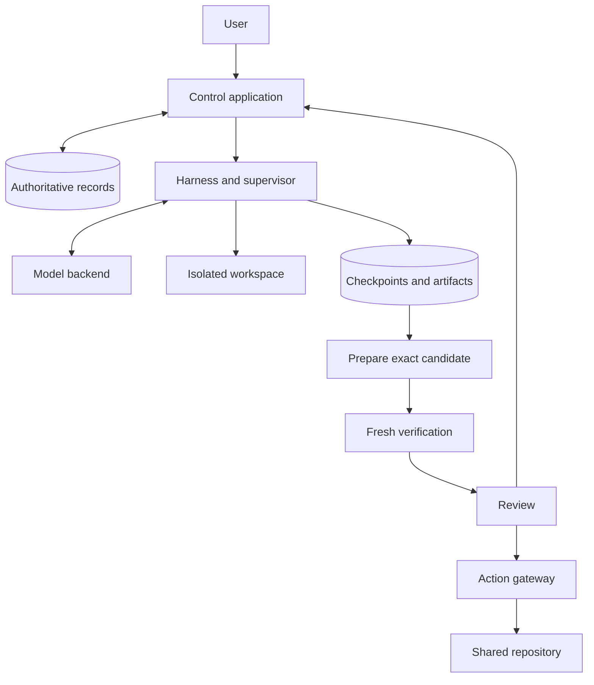

# Durable Orbs and a Minimal Agent Harness

**Design specification · September 25, 2026**

This document defines a complete initial implementation contract for a coding-agent platform. It consolidates the orb and harness designs into one specification. The design has been reviewed; implementation, fault injection, security enforcement, and performance measurements remain to be demonstrated.

**A task owns its work. A machine executes it.**

An orb is a durable task with an isolated workspace and an agent that can act inside it. The task retains its instructions, saved files, observations, proposed results, and decisions when its worker stops. A replacement worker resumes from an explicitly saved point.

The consumer must be able to leave, return, understand what happened, and decide what happens next. The maintainer must be able to identify the owner of every state transition and explain recovery without relying on a particular machine remaining alive.

Consider an agent that edits a file and reports that the edit succeeded. If its worker dies, restoring that report alongside the old file would give the replacement agent a false account of its work. The central rule is therefore stronger than saving files or saving a conversation: **every recoverable continuation pairs the conversation with the files it describes.**

**The initial release has a bounded scope.**

Support one repository per task, one model backend, one sandbox backend, one command tool, serial commands within a task, multiple independent tasks, and one repository-publication integration. Review-only tasks may finish without publication. A task records which finish condition applies when it is created.

The harness submits proposed results. The control application handles verification, review, and publication. The model has no direct external-write tool in the initial release.

Persistent preview services, recovery of service memory or mutable database contents, automatic child agents, arbitrary external integrations, model routing, plugin systems, and atomic changes across repositories are outside this release. Tests may start temporary services within a supervised command; those services stop with that command. Saved logs, screenshots, and artifacts remain available for review.

**The design has seven invariants.**

| ID | Required property |
|---|---|
| I1 | At most one authoring attempt has current authority to advance a task. Old attempts cannot regain authority by reconnecting. |
| I2 | An acknowledged continuation can be restored without the original worker’s disk. Its conversation cursor and file checkpoint describe the same completed work. |
| I3 | No action executes from an incomplete model response or an unconfirmed call-intent record. |
| I4 | Required verification evidence, review acceptance, and publication authorization identify exact candidate contents and the applicable task revision. |
| I5 | Every supported external mutation has a durable operation identity and an honest outcome. An unknown outcome is never silently converted into failure or success. |
| I6 | Parallel tasks own separate writable state. Publication checks the destination version before changing shared state. |
| I7 | Spending reservations remain allocated while a billable execution can still incur charges. A retry or replacement does not create free capacity. |

These are implementation requirements. The validation plan below defines how to exercise them.

**The control application owns authority; the harness owns the loop.**

| Component | Responsibility |
|---|---|
| Control application | Own task records, task revisions, workflow phase, leases, budgets, continuations, wakeups, and acceptance decisions |
| Harness | Prepare model input, accept complete responses through the controller, run approved calls in order, and propose results or questions |
| Trusted supervisor | Keep model credentials, enforce process and resource limits, run sandbox commands, capture observations, and prepare consistent snapshots |
| Sandbox | Hold editable repository files and execute repository code within enforced boundaries |
| Verification controller | Run the approved checks in fresh execution environments and attest their observations |
| Integration module | Construct the candidate that would be published against a recorded destination revision |
| Action gateway | Authorize, dispatch, record, and reconcile supported external mutations |

Begin with one control application, a transactional database, immutable object storage, and a trusted worker process controlling an isolated sandbox. Scheduling, integration, verification coordination, and the gateway can be modules in the control application. They do not each require a separate deployed service. The harness and supervisor can share a trusted process.

Keep trusted processes outside the writable sandbox. Repository code must not be able to modify them, read their credentials, forge their recording channels, or widen its authority. Enforce filesystem, process, and network boundaries outside the sandbox’s administrative control.



**Persist one authoritative recovery pointer.**

| Record | Required contents |
|---|---|
| Task | Owner, repository, immutable task revisions, current revision, finish condition, requested state, workflow phase, authority policy, and budget account |
| Attempt | Task revision, increasing execution epoch, lease expiry, observed process state, and current continuation reference |
| Continuation | File-checkpoint reference, environment version, committed conversation cursor, pending accepted turn, next call index, and version |
| Checkpoint | Immutable manifest of repository files and their contents; declared exclusions; provenance and snapshot sequence |
| Accepted turn | Controller turn ID, model-request slot, complete response, ordered calls, required backend continuation metadata, and consumption state |
| Call | Stable controller call ID, turn and ordinal, immutable arguments, execution tries, status, and observation reference |
| Candidate | Immutable source or build-artifact identity, task revision, base revision, environment identity, verification-profile version, and provenance |
| Verification evidence | Candidate identity, profile version, environment, observations, limits, and verification-controller identity |
| Acceptance | Exact candidate identity, task revision, applicable evidence, accepting actor or policy, and decision |
| External operation | Stable operation ID, immutable arguments and hash, candidate and task references, destination, expected destination version, authority basis, dispatch state, and receipt |
| Spending entry | Logical work reference, distinct billable-execution identity, reservation, observed usage, settlement, and any unresolved amount |

A task revision binds the instructions, finish condition, base-environment identity, required verification-profile version, and task-specific authority policy. Changing any of these creates a new revision and invalidates pending decisions bound to the old one. Updating a shared profile template does not silently alter existing tasks; applying that update creates a task revision. Live credential or access revocation takes effect immediately regardless of revision.

The continuation is the sole authoritative recovery reference. A newer file snapshot or log entry cannot independently replace it. Files and observations may be uploaded before a commit, but remain provisional until the database publishes their references together.

Use conditional database transactions to check the current task revision, attempt epoch, permitted task state, and expected prior continuation. Reject late uploads that would move progress backward. Store the state transition and its audit event in the same transaction.

Object uploads use narrow credentials or a trusted proxy. Workers cannot overwrite immutable artifacts or declare their own upload authoritative. Garbage collection protects active uploads, pending publications, retained continuations, candidates, and accepted results before reclaiming unreferenced objects.

**Keep requested state separate from workflow phase.**

Requested state is `active`, `paused`, or `cancelled`. Workflow phase is `work`, `verification`, `review`, `input`, `blocked`, `publication`, or `complete`. Observed process state records whether a worker is starting, running, draining, stopped, or lost.

Grant an authoring lease only when the task is active, its phase is work, no current authoring lease exists, and sufficient spending has been reserved. Grant a new increasing epoch in the same transaction. Renewals check the same authority using the database’s time.

A lease is temporary permission to advance authoritative state. It does not physically stop a process. Check its epoch and validity at every publication and dispatch boundary. A supervisor also enforces expiration and stops the affected execution boundary. If exclusive ownership of an old workspace cannot be established, a replacement receives a different workspace.

Durable wake requests may be delivered more than once. Their request identifiers and the lease-grant transaction prevent duplicate authorized attempts. A question or candidate handoff changes workflow phase, so an idle task does not immediately restart authoring just because it remains active.

**Run one small, explicit agent loop.**

The initial tool is `command`. It accepts a command string and a working directory inside the assigned workspace. The supervisor chooses the sandbox, environment, maximum duration, output limit, and execution identity. The model may request a shorter duration but cannot raise its limit or choose a host execution context.

Validate tool names and argument structure at the model-adapter boundary. Treat every command as potentially changing local state. Run commands serially. Keep process supervision, lease checks, and stop handling responsive while a model request or command is in progress.

Stop all command descendants before acknowledging its result and snapshot. Do not permit unmanaged background processes. Network access is restricted to supported read access and controlled dependency sources; external mutation credentials remain with the gateway. The model adapter does not enable hosted tools that execute outside these controls.

Model responses can contain tool calls or a structured proposal: `candidate_ready`, `input_needed`, or `blocked`. A proposal includes a short explanation. It does not accept the task or establish that its checks passed.

```text
state = restore_authoritative_continuation()

while controller.permits_this_authoring_attempt():
    turn = load_pending_turn(state)
    if turn is absent:
        input = compose_model_input(state, controller.current_task())
        response = model.generate_complete_response(input)
        state, turn = controller.accept_response_once(response, state)

    for call in turn.remaining_calls:
        if call is invalid or unsupported:
            state = controller.commit_call_error(call, state)
            continue

        permit = controller.authorize_current_call(call)
        if permit is denied:
            return supervisor.stop_and_report()

        controller.confirm_call_intent(call, state)
        observation = supervisor.run_bounded_command(call)
        files = supervisor.snapshot_after_stopping_writers()
        state = controller.commit_observation_and_files(
            call, observation, files, expected_state=state)

    state, handoff = controller.consume_turn_once(turn, state)
    if handoff exists:
        return supervisor.stop_and_handoff(handoff)

return supervisor.stop_and_report()
```

This is structural pseudocode. Each controller operation independently validates current authority. Failed persistence, lost acknowledgments, and control changes stop the ordinary path and use the recovery rules below. The loop’s first check alone is insufficient authorization.

**Consume each model decision once.**

Display streamed text as provisional. Execute nothing until a complete response has been durably accepted. The controller accepts one response per model-request slot. Late duplicate responses remain historical observations and cannot create another action batch.

Save a returned batch before executing its first call. Assign each call a stable controller identity based on the accepted turn and ordinal. Preserve backend call identifiers separately for constructing valid follow-up requests. Replacing the worker does not change a logical call’s identity.

After all calls have terminal observations, one transaction consumes the turn, clears its pending pointer, and either creates the next request slot or records its handoff. The transaction checks the current revision, epoch, and permitted state even when the response contains no tool calls. Handoffs are keyed by turn ID, so retries return the existing handoff.

A complete response with neither calls nor a valid proposal records an invalid-response observation, consumes its slot, and receives a bounded correction attempt. Malformed calls receive explicit error observations without execution. Neither case may create an endless loop.

**Save observations and files together after every command.**

Confirm the call-intent record before execution. After the command terminates and its writers stop, upload the observation and consistent file checkpoint. Atomically advance their references, the conversation cursor, and next call index under the expected prior continuation.

A nonzero exit is an observation, not a storage failure. Commit its actual output and resulting files so the model can inspect partial changes. A command that has not reached a confirmed continuation commit remains uncommitted, regardless of provisional logs or uploaded objects.

If a persistence response is lost, query its stable identity before proceeding. If the controller cannot establish the outcome, stop at that boundary. Never infer from a timeout that the commit failed.

The initial recovery contract covers repository files, durable task history, and observations. Temporary process state is discarded. Every command ends in a continuation commit; less frequent checkpointing is a later optimization that must preserve the same recovery invariant.

Pin the base environment by immutable identity. System tools and configuration in that base are read-only to task commands. The workspace is the only durable writable root in the initial release; its checkpoint includes dependency files and configuration even when Git ignores them. Install project dependencies there. Other permitted writable directories are declared disposable scratch space. Changing system tools requires selecting a new prepared environment in a new task revision. Record the environment change for the next attempt and rebuild affected dependencies before relying on them.

On replacement, restore the pinned base and the workspace checkpoint. Before the next model request, append a controller observation naming the restored continuation and stating that scratch files and processes were discarded. The recovery snapshot and the submitted source candidate have separate manifests: recoverable dependency files need not be proposed source changes.

On failure, stop or isolate the old execution boundary and restore the latest acknowledged continuation. An interrupted command can be replayed only when its changes were confined to recoverable repository state or disposable sandbox state. Record another execution try and use its actual result. Untracked persistent or remote changes make the outcome uncertain and block dependent work.

If a committed checkpoint is missing or corrupt, recovery fails visibly. Choosing an older continuation requires an explicit recovery decision that reports lost progress and preserves external-operation records. Never place a newer conversation over older files.

Suspended machines are optional caches. Before assigning one to another epoch, confirm that the old agent and command descendants have stopped. Refresh credentials and validate its environment. Losing the machine cache must not lose an acknowledged continuation.

**Define pause, cancellation, and redirection precisely.**

Pause prevents new model calls, command dispatches, authoring lease grants, terminal handoffs, and publication dispatch authorizations. The current command receives a bounded drain window. Under a restricted drain permit, the supervisor may commit its terminal or interrupted observation together with the files that observation describes. It then fences the attempt. If that paired commit cannot finish before the deadline, preserve the previous continuation and discard uncommitted work. Pause never saves files alone. External dispatches already authorized may still reach their destination; reconcile and display them as described below.

Cancellation immediately revokes new authoring and mutation authority. The supervisor cancels model requests and stops commands. The interface reports stopping until termination or isolation is confirmed, and continuing billable compute remains visible. Recovery guarantees only the last acknowledged continuation. A previously authorized external dispatch may still reach its destination or finish and remains subject to reconciliation.

Redirection creates a new task revision and invalidates pending decisions from the old one. Undispatched calls receive `not_executed: superseded` observations. An interrupted local call gets an honest interruption record after its uncommitted changes are discarded or deliberately paired and saved through an authorized transition. Preserve committed results and their matching files. Begin the revised job from a coherent continuation and a new request slot. Do not resume work while requested state is paused or cancelled.

The model adapter accounts for every accepted call when preparing a follow-up request. Outstanding external uncertainty remains visible across all these transitions.

**Build model input from authoritative state.**

Every request includes the current task, finish conditions, limits, workspace description, tool definitions, and relevant committed observations. Repository text and command output are data. They cannot change permissions, task revision, or completion criteria.

Retain full visible history in durable storage. When it no longer fits, summarize older completed turns into a short memo that names its source range. Keep current instructions, unresolved work, and operation receipts separately and exactly. A model-written memo is a fallible navigation aid and cannot establish permissions, verification, or completed actions. Recovery does not depend on access to private model reasoning.

Store large output as bounded task artifacts and provide useful excerpts. Approved read-only copies can be made available to commands for inspection. Apply task access controls to prompts, files, and logs. Keep known credentials out of collection paths; arbitrary output cannot be assumed safe because a text filter ran.

If mandatory instructions and unresolved state cannot fit, yield a context-limit blocker. Bound model requests, command duration, corrective retries, execution steps, output storage, and spending through an explicit run profile.

**A proposed result enters a separate completion path.**

The terminal-turn transaction captures a candidate from committed state, records the handoff, changes workflow phase, and closes authoring authority. The supervisor stops the worker. Verification and integration use their own constrained controller authority.

For a review-only task, verify the proposed candidate directly. For a publication task, first construct the exact integration candidate against the current destination revision. If integration cannot resolve the changes, record the conflict and deliberately return the task to work with those diagnostics.

Run required checks on the resulting immutable candidate. Only the verification controller may publish evidence that satisfies those checks. It records the candidate, approved profile, environment, and observations through a channel outside the candidate’s authority. The authoring harness’s logs remain useful supporting material but cannot impersonate verification evidence.

Keep the required test harness and reporting channel outside the candidate’s writable namespace. Tests written by the task can add evidence but cannot silently replace approved checks. Record relevant external inputs and any limits on reproducibility.

Successful verification moves the task to review. A failed check records diagnostics and deliberately returns it to work, subject to requested state and remaining budget. An answered question likewise creates an explicit runnable transition and a new request slot.

Verification and integration callbacks change phase only through an idempotent conditional transaction matching the current task revision, active handoff and candidate, expected phase, and authorized run identity. Stale or duplicate callbacks may retain their evidence but cannot redirect the current task. A callback received while paused may record its observation; authoring and publication remain blocked by requested state.

Review acceptance is a conditional decision about exact candidate contents under the current task revision and verification profile. A stale review screen cannot accept a revised task. The initial release carries no approval automatically onto changed integration contents: a new candidate requires applicable checks and review again.

For publication, a separate authorization names the accepted candidate, destination, and expected destination revision. A publication receipt records what the destination actually accepted. Completion conditionally joins the current acceptance with the required receipt. Review-only completion needs no publication receipt. An unresolved operation required by the finish condition blocks completion.

Completion makes authoring wakes ineligible. It does not erase outstanding accounting or reconciliation obligations.

**Register external operations before dispatch.**

The initial integration module is the sole requester of repository mutations. One controller transaction records immutable operation arguments, authorization basis, candidate, destination, and expected destination version, then links that operation to the task’s publication phase. Dispatch cannot occur before registration is confirmed.

The gateway serializes dispatch authorization with revocation in the control database. New publication dispatch and mutation retries require requested state active and workflow phase publication. The transaction also checks the current task revision, integration ownership, exact publication authorization, applicable acceptance and evidence, and available spending. A changed required profile creates a new task revision and invalidates pending authorization. An already authorized older operation remains visible but cannot automatically complete the revised task.

The committed dispatch-authorization transaction is the ordering point. Revocation blocks subsequent authorizations. An already authorized dispatch may reach the destination afterward and is shown as potentially in flight. Claim each network attempt for one dispatcher using a recorded execution identity and lease. An uncertain dispatcher failure requires reconciliation; it does not permit another dispatcher to reuse that attempt blindly. Each retry creates a new dispatch attempt and requires a fresh authorization check, while retaining the logical operation ID.

Use destination-supported idempotency or conditional writes where available. Reusing an operation ID with different arguments is rejected. If a response is lost after the request may have succeeded, record `outcome_unknown` and reconcile through a supported read operation. Without a reliable deduplication or lookup protocol, stop for resolution.

Every newly authorized mutation request, including a retry, requires current authority. Paused or cancelled tasks permit read-only reconciliation, but no new mutation authorization. A request authorized before the state change may complete. Any compensating action requires separate authorization.

Before publishing, conditionally update the destination only if its expected revision still matches. If another change wins, prepare a new integration candidate, rerun required checks, and obtain new acceptance. This prevents silent overwrites by participating tasks; checks and review still determine behavioral compatibility.

If a future release adds a model-facing external-action tool, its registration transaction must also link the pending operation to the harness continuation before dispatch. Recovery must retain that identity rather than regenerate the action.

**Reserve spending for physical executions, not just logical requests.**

Worker allocations, model generations and retries, verification runs, and paid gateway actions use the task’s budget ledger. Reserve before starting each bounded billable execution. Distinct billable attempts receive distinct reservation identities even when they share a logical request or operation ID.

Keep a reservation while its execution can still incur charges or its cost remains uncertain. Releasing an authoring lease does not release its worker reservation. A replacement requires another reservation. Settlement and release are idempotent transitions keyed to the billable execution.

Exact invoice ceilings require enforceable provider limits and bounded termination delay. The system enforces admissions and exposes unresolved reservations; it must not advertise stronger financial guarantees than its configured providers support.

**Make returning to work the main user experience.**

The task view shows the current goal, observed state, changes, applicable evidence, next decision, and spending. Summaries link to underlying observations and show when they are stale. Saved review data remains accessible without a live worker.

An example view:

> **Dark mode — ready for review**
> Request: add a manual theme choice while preserving the system default.
> Changed: added the selector and retained the existing default behavior.
> Checks: required browser checks passed for this version.
> Next: inspect the saved appearance screenshots and accept or request a change.
> Worker stopped. Reviewing these results does not start compute.

This illustrates the interface; it is not an observed test result. If evidence is incomplete or superseded, show that state and offer the required next action instead of presenting acceptance as ready.

Bound unfinished automatically started work, counting tasks awaiting review. Stop automatic starts when the configured limit is reached. Explicit user starts may exceed this attention limit with the backlog visible, subject to hard execution and spending limits. Track review delay alongside accepted throughput.

**Configure capabilities explicitly before admitting work.**

The execution backend must support enforced isolation, bounded execution, independent termination or isolation confirmation, consistent repository snapshots, and restore into a fresh workspace. The control storage must provide conditional transactions; artifact storage must confirm durable uploads and preserve referenced immutable contents.

The model adapter must support complete-response validation, stable request bookkeeping, tool-result formatting, output limits, and cancellation or an honest record of uncancelled billable work. It preserves backend continuation fields without exposing provider-specific transport details to the main loop.

The repository connector must provide conditional destination updates and a documented way to reconcile uncertain operations. Reject publication configuration that cannot support the stated contract. Review-only work remains available.

A run profile specifies finite lease and drain durations, model and command limits, correction and step limits, output and storage limits, spending policy, and required verification profile. Retention configuration names the treatment of histories, checkpoints, accepted artifacts, audit records, credentials, and backups. Admission rejects missing required capabilities or limits. Vendor selection and numerical tuning do not change the invariants.

Deletion first marks the task unavailable for new work, revokes authority, and blocks late uploads and wakeups. Retention workers then remove the promised records and unreferenced artifacts. Already published commits and external service records remain governed by their own owners; task deletion does not claim to retract them.

**Keep the first implementation easy to trace.**

Use a main loop module, a model adapter, a supervisor/runner, a context builder, and a controller client where these responsibilities need separation. Avoid pass-through layers and a generic workflow language. Keep state definitions and transitions together in the control application.

The chosen design combines the continuity of a persistent workspace with explicit recovery. A machine-per-task design offers simpler initial interaction but makes recovery depend more heavily on machine state. Fully stateless workers make bounded jobs easier to replace but require exploratory work to reconstruct its environment repeatedly. The hybrid’s extra bookkeeping is justified only if the validation and workload measurements support it.

**Build and validate in four increments.**

| Increment | Deliverable | Exit condition |
|---|---|---|
| 1. Useful authoring | Durable task records; one model; one command tool; isolated execution; explicit yields and limits | Complete a small repository task, reject malformed calls, and stop a long command through the real supervisor |
| 2. Recoverable work | Paired continuations, stable turns and calls, revision handling, and stop/resume | Restore correctly after failures around every acknowledgment boundary; stale workers cannot advance state |
| 3. Verified results | Immutable candidates, controller-owned evidence, review, questions, and handoffs | Saying done cannot accept work; changed instructions and fabricated worker reports cannot satisfy required checks |
| 4. Controlled publication | Integration queue, exact acceptance, durable operations, budget settlement, and destination receipts | Conflicting destination changes and lost external responses produce no silent overwrite or blind duplicate mutation |

The initial release is complete only when all four increments meet their exit conditions. Use scripted model responses to inject exact failures, then exercise the same harness and sandbox with a real model. Scripted responses alone do not prove process isolation, provider behavior, or durable storage.

**The failure matrix is the release gate.**

| Scenario | Required outcome |
|---|---|
| Duplicate wake delivery or reconnecting old worker | At most one current authoring authority; stale state publication and dispatch rejected |
| Lost model stream after partial tool arguments | No tool executes from the partial response |
| Duplicate complete response | Only one accepted response and batch for its request slot |
| Empty response or unsupported tool | Explicit error and bounded correction; no accidental dispatch or endless pending turn |
| Crash before a call-intent acknowledgment | No command starts until registration is confirmed |
| Crash after a local edit but before continuation commit | Restore the earlier matching history and files; retain an honest interruption record |
| Observation upload without checkpoint commit | Provisional output cannot enter active context as completed work |
| Committed continuation followed by worker loss | Restore its exact files before exposing its observations |
| Out-of-order snapshot uploads | The current continuation cannot move backward |
| Failure halfway through a call batch | Committed calls remain completed; resume at the first uncommitted call |
| Pause during a command | Commit a paired final observation and files within the drain permit, or retain the preceding continuation |
| Cancellation or redirection during generation | Old decisions cannot dispatch or produce a current-revision handoff |
| Crash after recording a question or candidate | Return the same handoff; do not create another |
| Handoff while task remains active | No authoring lease is granted outside the work phase |
| Delayed verification or integration callback belongs to an older candidate | Keep its evidence without changing the current phase |
| Old processes remain in a suspended workspace | Do not assign that writable workspace to the replacement |
| Replacement worker restores a task with installed dependencies | Restore dependencies from the saved workspace and report discarded scratch state; the base environment remains pinned |
| Referenced checkpoint is missing or corrupt | Visible recovery failure; no mismatched older-files/newer-history fallback |
| Worker uploads fabricated passing evidence | It cannot satisfy the required verification profile |
| Candidate, task revision, or required profile changes during review | Stale acceptance fails its conditional transaction |
| Destination changes after candidate verification | Conditional publication fails; new integration result gets checked and reviewed |
| External mutation succeeds but its response is lost | Reconcile the registered operation; no blind retry |
| Revocation occurs before a mutation retry | Read-only reconciliation may continue; the mutation is not reissued without new authority |
| Pause races publication authorization | Ordering in the control database determines whether a dispatch was already authorized; no later authorization proceeds |
| Worker, model request, or verification run remains billable after replacement | Its reservation remains; replacement spending requires another reservation |
| Deletion races a wake, upload, or publication | New authority is blocked; retained external obligations remain visible under retention policy |
| Reviewer opens a task whose worker is unavailable | Saved goal, changes, evidence, spending, and next decision remain accessible |

Operational logs carry task revision, attempt epoch, turn and call IDs, continuation identity, candidate identity, and external-operation identity where applicable. Use these to reconstruct a failure without reading an entire conversation.

Measure restore success, lost uncommitted work, checkpoint overhead, restore latency, storage consumption, accepted-task cost, uncertain or duplicated external outcomes, and review delay on a fixed repository workload. Establish numerical release thresholds before running that workload. Claims about improved speed, cost, reliability, or reviewer effort require those measurements.
